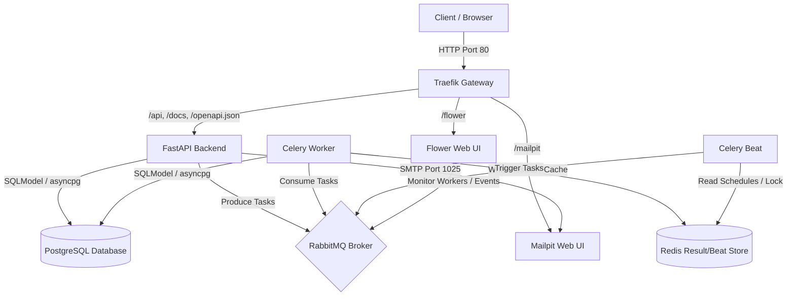

# Backend Architecture Documentation

This document describes the design, components, and integration flows of the backend architecture.

## Overview

The application follows a containerized microservices-adjacent design, where all services run inside a unified Docker network. HTTP traffic is routed through a single gateway entry point, and tasks are executed asynchronously via a distributed worker queue.

---

## Consoles & Access URLs

Below is the list of web consoles and API endpoints available in the local development environment:

| Service / Console | Access URL | Port / Proxy Path | Default Credentials |
| :--- | :--- | :--- | :--- |
| **FastAPI Interactive Docs** | [http://localhost/api/v1/docs](http://localhost/api/v1/docs) | HTTP `80` (`/api/v1/docs`) | None |
| **FastAPI Redoc Docs** | [http://localhost/api/v1/redoc](http://localhost/api/v1/redoc) | HTTP `80` (`/api/v1/redoc`) | None |
| **Flower (Celery Monitor)** | [http://localhost/flower/](http://localhost/flower/) | HTTP `80` (`/flower/`) | None |
| **Mailpit (Local Mail Client)** | [http://localhost/mailpit/](http://localhost/mailpit/) | HTTP `80` (`/mailpit/`) | None |
| **Traefik Admin Dashboard** | [http://localhost:8080/dashboard/](http://localhost:8080/dashboard/) | Port `8080` (`/dashboard/`) | None |
| **RabbitMQ Management Portal** | [http://localhost:15672](http://localhost:15672) | Port `15672` | Username: `guest`   Password: `guest` |

---

## Core Components

### 1. Gateway Routing (Traefik)
- **Role**: Reverse proxy and ingress gateway.
- **Port**: Exposed to the host on port `80`.
- **Discovery**: Automatically discovers container metadata from labels via the read-only mount of `/var/run/docker.sock`.
- **Paths**:
  - `/api/*`, `/docs`, `/redoc`, `/openapi.json` $\rightarrow$ FastAPI Backend
  - `/flower/*` $\rightarrow$ Flower (Celery Monitoring Console)
  - `/mailpit/*` $\rightarrow$ Mailpit Web Console

### 2. API Application (FastAPI Backend)
- **Role**: Serves the REST API, manages database transactions, and offloads heavy background operations.
- **ORM & DB**: Uses [SQLModel](https://sqlmodel.tiangolo.com/) built on top of SQLAlchemy, utilizing the asynchronous driver `asyncpg`.
- **Settings**: Implements type-safe settings validation via `pydantic-settings` from [config.py](file:///d:/python/banking-fullstack/backend/infrastructure/config.py) and [.env.local](file:///d:/python/banking-fullstack/backend/.env.local).

### 3. Database (PostgreSQL)
- **Role**: Primary relational storage.
- **Image**: `postgres:16-alpine`
- **Volume Mount**: Uses the `postgres_data` volume to persist database states across rebuilds.

### 4. Message Broker (RabbitMQ)
- **Role**: Durable message broker routing Celery task messages.
- **Console**: Exposes its administrative interface at `http://localhost:15672` (auth: `guest` / `guest`).

### 5. Cache & Scheduler DB (Redis)
- **Role**: Stores Celery task execution results and manages dynamic cron scheduler records.
- **Client**: Configured as the backing store for RedBeat.

### 6. Background Workers (Celery & Celery Beat)
- **Celery Worker**: Multi-threaded prefork workers consuming tasks published to RabbitMQ.
- **Celery Beat**: A periodic scheduler using `RedBeatScheduler` to dynamically store, fetch, and lock scheduling definitions in Redis. Tasks are auto-discovered from files named `tasks.py` inside modules and [infrastructure/tasks.py](file:///d:/python/banking-fullstack/backend/infrastructure/tasks.py).

### 7. Email Testing Sandbox (Mailpit)
- **Role**: Local mock SMTP server capturing all outgoing emails.
- **SMTP Port**: `1025`
- **Web UI**: Exposes an inbox client at `http://localhost/mailpit/` to inspect sent emails (HTML/text, attachments, headers) without hitting real external mail APIs.

---

## Data Directories & Configuration Files

- **Settings**: Defined in [config.py](file:///d:/python/banking-fullstack/backend/infrastructure/config.py) and populated by [.env.local](file:///d:/python/banking-fullstack/backend/.env.local).
- **Docker Compose**: Orchestration metadata defined in [docker-compose.yml](file:///d:/python/banking-fullstack/docker-compose.yml).
- **Dockerfile**: Application image parameters defined in [Dockerfile](file:///d:/python/banking-fullstack/backend/Dockerfile).
- **Database Engine & Sessions**: Declared in [database.py](file:///d:/python/banking-fullstack/backend/infrastructure/database.py).
- **Celery Application**: Declared in [celery.py](file:///d:/python/banking-fullstack/backend/infrastructure/celery.py).
