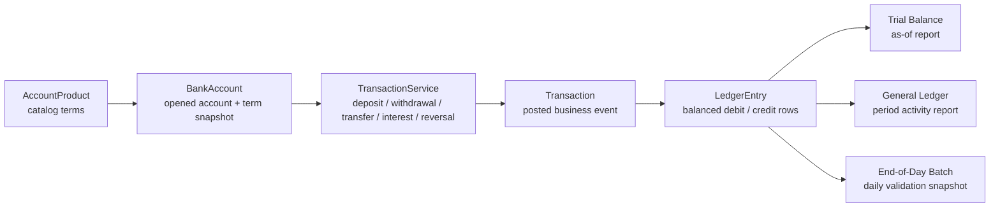
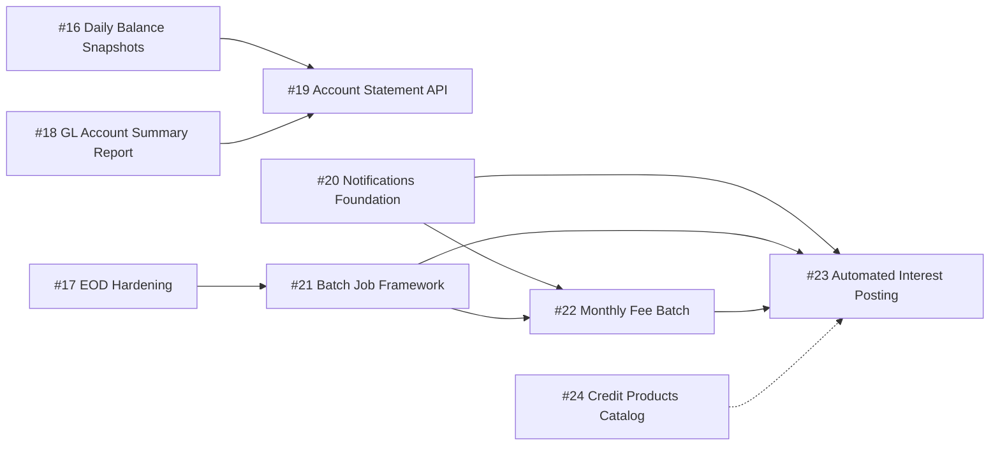

# Banking Products Architecture & PR Roadmap

This document describes the current backend architecture for `banking-fullstack`,
with emphasis on banking products, account term snapshots, transaction ledger
flows, financial reports, end-of-day audit batches, and the next backend PR
roadmap from `#16` through `#24`.

## Executive Summary

The backend uses a flat FastAPI module structure under `backend/modules/`.
Each feature area keeps its own routes, schemas, services, models, and enums
where needed. The app registers routers explicitly in `backend/main.py`, and
database tables are registered for SQLModel metadata creation by importing
models in `backend/infrastructure/database.py`.

The current banking product architecture is deposit-account focused.
`AccountProduct` acts as the catalog template, while `BankAccount` stores the
opened account and snapshots product terms such as account type, currency,
interest rate, minimum balance, monthly fee, and fixed-deposit terms. Product
edits affect future account openings only.

Money movement is handled through posted transactions and balanced ledger
entries. Customer accounts and internal accounts are both represented in the
ledger, with each `LedgerEntry` targeting exactly one of a customer account or
an internal account. Reports and end-of-day batches read from this ledger rather
than reposting or recalculating account balances.

## Current Module Inventory

| Module | Purpose | Public Surface |
| --- | --- | --- |
| `auth` | Registration, OTP verification, login, logout, password reset, and current-user authentication. | `/api/v1/auth` |
| `users` | User profile/admin user management, staff creation, roles, status changes, and RBAC permission mapping. | `/api/v1/users`, `/api/v1/admin/users` |
| `customer_profiles` | Customer profile and KYC data, plus admin KYC review actions. | `/api/v1/customer/profile`, `/api/v1/admin/kyc/profiles` |
| `next_of_kin` | Customer next-of-kin records and primary-contact management. | `/api/v1/customer/next-of-kin` |
| `accounts` | Customer bank accounts, account status operations, internal accounts, and account opening. | `/api/v1/customer/accounts`, `/api/v1/admin/accounts`, `/api/v1/admin/internal-accounts` |
| `products` | Deposit account products catalog, lifecycle transitions, and active product browsing. | `/api/v1/customer/products`, `/api/v1/admin/products` |
| `transactions` | Deposits, withdrawals, transfers, fees, manual interest posting, reversals, and transaction ledger access. | `/api/v1/customer/transactions`, `/api/v1/admin/transactions` |
| `reports` | Read-only financial reporting from ledger data. | `/api/v1/admin/reports/trial-balance`, `/api/v1/admin/reports/general-ledger` |
| `batches` | Manual end-of-day audit closes and persisted validation snapshots. | `/api/v1/admin/batches/end-of-day` |

## Backend Architecture

### Flat Module Pattern

The backend intentionally uses flat modules, not DDD layering. A typical module
contains:

- `models.py` for SQLModel tables.
- `schemas.py` for request and response contracts.
- `services.py` for business logic.
- `routes.py` for FastAPI endpoints.
- `enums.py` where string enums are shared between models, schemas, and routes.

Modules are wired manually. New routers are imported into `backend/main.py` and
mounted under the appropriate `/api/v1/...` prefix. New SQLModel tables are
registered by importing their models in `backend/infrastructure/database.py`.

### Router Map

```mermaid
flowchart TB
    App["FastAPI app in backend/main.py"]

    App --> Auth["auth_router<br/>/api/v1/auth"]
    App --> Users["users_router<br/>/api/v1/users"]
    App --> AdminUsers["admin_router<br/>/api/v1/admin/users"]
    App --> Profiles["customer_profile_router<br/>/api/v1/customer/profile"]
    App --> Kyc["admin_kyc_router<br/>/api/v1/admin/kyc/profiles"]
    App --> Kin["next_of_kin_router<br/>/api/v1/customer/next-of-kin"]
    App --> CustomerAccounts["customer_accounts_router<br/>/api/v1/customer/accounts"]
    App --> AdminAccounts["admin_accounts_router<br/>/api/v1/admin/accounts"]
    App --> InternalAccounts["admin_internal_accounts_router<br/>/api/v1/admin/internal-accounts"]
    App --> CustomerProducts["customer_products_router<br/>/api/v1/customer/products"]
    App --> AdminProducts["admin_products_router<br/>/api/v1/admin/products"]
    App --> Reports["admin_reports_router<br/>/api/v1/admin/reports"]
    App --> Batches["admin_batches_router<br/>/api/v1/admin/batches"]
    App --> CustomerTransactions["customer_transactions_router<br/>/api/v1/customer/transactions"]
    App --> AdminTransactions["admin_transactions_router<br/>/api/v1/admin/transactions"]
```



### Database Registration

The current backend does not use an Alembic migration tree. Fresh and test
databases are created from SQLModel metadata. The following model groups are
registered by imports in `backend/infrastructure/database.py`:

- `users`
- `customer_profiles`
- `next_of_kin`
- `bank_accounts`
- `internal_accounts`
- `account_products`
- `transactions`
- `ledger_entries`
- `fee_rules`
- `end_of_day_batches`
- `end_of_day_batch_currency_summaries`
- `end_of_day_batch_validation_issues`

Any PR that adds a SQLModel table must update `database.py` and test cleanup
ordering. It should not add Alembic migration files unless the repo adopts a
migration tree first.

### RBAC Pattern

Permissions are centralized in `modules/users/permissions.py` as
`UserPermission` values mapped to `RoleChoicesSchema` roles. Routes use
`require_user_permission(...)` guards instead of ad hoc role checks.

Current financial-control permissions include:

- `READ_ACCOUNT_PRODUCTS`
- `MANAGE_ACCOUNT_PRODUCTS`
- `READ_TRANSACTIONS`
- `POST_BANK_TRANSACTIONS`
- `REVERSE_BANK_TRANSACTIONS`
- `READ_FINANCIAL_REPORTS`
- `READ_END_OF_DAY_BATCHES`
- `RUN_END_OF_DAY_BATCHES`

The existing pattern separates read permissions from control-action permissions.
For example, branch managers can read financial reports and EOD batches, while
EOD execution is limited to admin and super admin.

## Banking Product Architecture

### Account Products

`AccountProduct` is the deposit product catalog table. It stores:

- Product identity: `code`, `name`, `description`.
- Product classification: `account_type`, `currency`, `status`.
- Account terms: `interest_rate`, `minimum_opening_deposit`,
  `minimum_balance`, `monthly_fee`.
- Fixed-deposit terms: `fixed_deposit_term_months`,
  `early_withdrawal_penalty_rate`.

Product statuses are `draft`, `active`, and `retired`. Customer product browsing
returns active products. Staff/admin product routes support listing, detail,
creation, updates, activation, and retirement.

Fixed-deposit term and penalty fields are creation-time terms. Updating those
terms requires retiring the product and creating a new product.

### Bank Account Snapshots

`BankAccount` represents an opened customer account. It links back to
`AccountProduct` through nullable `product_id`, then snapshots the account terms
at opening time:

- `account_type`
- `currency`
- `interest_rate`
- `minimum_balance`
- `monthly_fee`
- `fixed_deposit_term_months`
- `fixed_deposit_maturity_date`
- `early_withdrawal_penalty_rate`

This design lets product edits affect future accounts without silently changing
existing customer accounts.

### Financial Data Flow



## Transaction And Ledger Architecture

`Transaction` records the business event: deposit, withdrawal, transfer,
interest posting, reversal, or failed transaction. It includes reference,
transaction type, status, source/destination account references, amount, fee
amount, total debit amount, currency, creator, reversal metadata, `posted_at`,
and `created_at`.

`LedgerEntry` records the accounting movement. Each entry stores:

- `transaction_id`
- exactly one target: `customer_account_id` or `internal_account_id`
- `entry_type`: `debit` or `credit`
- `amount`
- `currency`
- `balance_after`
- `created_at`

`InternalAccount` supports system-side ledger targets such as:

- `CASH_SETTLEMENT`
- `FEE_INCOME`
- `INTEREST_EXPENSE`

Deposit, withdrawal, transfer, fee, interest posting, and reversal flows create
balanced ledger entries. Reversal behavior does not delete or exclude the
original transaction; reversal entries offset the original activity.

## Reporting Architecture

Reports are read-only and derive from existing ledger data.

### Trial Balance

Endpoint:

```text
GET /api/v1/admin/reports/trial-balance?currency=USD&as_of=2026-07-05
```

The trial balance is an as-of report. It includes ledger entries posted up to
and including the `as_of` date, groups by account target, omits zero-net lines,
and validates that each included ledger row has exactly one account target.

### General Ledger Activity

Endpoint:

```text
GET /api/v1/admin/reports/general-ledger?currency=USD&from_date=2026-07-01&to_date=2026-07-05
```

The general ledger report is a period activity report. It returns entry-level
ledger rows ordered by accounting date and supports filters for account target
type, account id, account code, transaction type, limit, and offset. Totals are
for the returned page.

## End-of-Day Batch Architecture

End-of-day batches are manual audit closes for a UTC business date. They do not
post fees, calculate interest, schedule jobs, or block late postings. They
persist validation snapshots for the day.

Current endpoints:

```text
POST /api/v1/admin/batches/end-of-day
GET /api/v1/admin/batches/end-of-day
GET /api/v1/admin/batches/end-of-day/{batch_id}
```

Current persisted tables:

- `end_of_day_batches`
- `end_of_day_batch_currency_summaries`
- `end_of_day_batch_validation_issues`

Validation currently checks:

- ledger entries have exactly one target
- posted/reversed transactions have ledger entries
- posted/reversed transaction entries balance debit and credit
- ledger entry currency matches transaction currency
- failed transactions do not have ledger entries

## Roadmap Dependency Flow



The dotted `#24` edge means the credit catalog can proceed in parallel after the
deposit catalog is stable; it should not block automated deposit interest work.

## PR Roadmap

### #16 Daily Balance Snapshots

| Field | Value |
| --- | --- |
| Branch | `feat/daily-balance-snapshots` |
| PR title | `feat(backend): add daily balance snapshots` |
| Purpose | Establish per-account daily balance history for statements and historical reporting. |

Key backend changes:

- Add a flat module or account-adjacent service for daily balance snapshot reads
  and writes.
- Add a snapshot table keyed by account, business date, and currency.
- Capture opening balance, closing balance, available balance, current balance,
  debit totals, credit totals, and transaction count for the day.
- Build snapshots from posted ledger activity and account balances without
  changing posting behavior.

Likely APIs and tables:

- Admin endpoint to generate or inspect snapshots by date.
- Customer/admin read endpoint can be deferred if the first PR only creates the
  data foundation.
- New table: `daily_balance_snapshots`.

Tests:

- Empty-day snapshot creation.
- Deposit, withdrawal, transfer, fee, interest, and reversal impact.
- Multi-currency separation.
- Duplicate run idempotency.
- Account/date uniqueness.

Explicit exclusions:

- No statement rendering.
- No PDF/CSV export.
- No scheduler.
- No business-date lock.

### #17 EOD Hardening

| Field | Value |
| --- | --- |
| Branch | `feat/eod-hardening` |
| PR title | `feat(backend): harden end-of-day batch controls` |
| Purpose | Build on manual EOD batches with stronger validation and operational controls. |

Key backend changes:

- Extend the existing `batches` module rather than creating a replacement EOD
  implementation.
- Add stronger issue classification and clearer failure messages.
- Add optional linkage from EOD batches to daily balance snapshot results once
  `#16` exists.
- Improve list/detail filtering for operational review.

Likely APIs and tables:

- Keep existing `/api/v1/admin/batches/end-of-day` endpoints.
- Add fields only where needed for hardening, such as run notes, locked result
  indicators, or validation summary counters.

Tests:

- Existing completed duplicate behavior remains unchanged.
- Failed rerun behavior remains safe.
- New validations create failed batches with actionable issues.
- Branch manager read-only and admin/super admin run permissions remain intact.

Explicit exclusions:

- No scheduler.
- No automated fee or interest posting.
- No hard close that blocks late postings unless explicitly added in a later PR.

### #18 GL Account Summary Report

| Field | Value |
| --- | --- |
| Branch | `feat/gl-account-summary-report` |
| PR title | `feat(backend): add GL account summary report` |
| Purpose | Add account-level GL summary totals separate from entry-level GL activity. |

Key backend changes:

- Extend the `reports` module with a summary report service method and route.
- Group ledger activity by account target and currency for a date range.
- Return debit total, credit total, net debit, net credit, transaction count,
  ledger entry count, and last activity date per account.

Likely APIs and tables:

- `GET /api/v1/admin/reports/general-ledger/accounts`
- Required query params: `currency`, `from_date`, `to_date`.
- Optional filters should mirror the entry-level general ledger report where
  sensible.
- No new table.

Tests:

- RBAC matches `READ_FINANCIAL_REPORTS`.
- Date range and currency filters.
- Customer and internal account grouping.
- Reversal activity nets correctly.
- Pagination or limit behavior if included.

Explicit exclusions:

- No chart of accounts.
- No normal-balance model.
- No export endpoint.

### #19 Account Statement API

| Field | Value |
| --- | --- |
| Branch | `feat/account-statement-api` |
| PR title | `feat(backend): add account statement API` |
| Purpose | Use transactions, ledger entries, and daily balance snapshots to expose customer/admin statement data. |

Key backend changes:

- Add statement service logic that builds statement periods for a single account.
- Use daily balance snapshots for opening and closing balances.
- Use transactions and ledger entries for period activity lines.
- Provide customer-owned access and admin/staff access.

Likely APIs and tables:

- `GET /api/v1/customer/accounts/{account_id}/statement`
- `GET /api/v1/admin/accounts/{account_id}/statement`
- Query params: `from_date`, `to_date`.
- No new table if `#16` already provides daily balance snapshots.

Tests:

- Customer can read only their own account statement.
- Admin/staff permissions.
- Opening/closing balance correctness.
- Deposit, withdrawal, transfer, fee, interest, and reversal lines.
- Empty period statement.

Explicit exclusions:

- No PDF/CSV export.
- No customer notification.
- No statement archival table.

### #20 Notifications Foundation

| Field | Value |
| --- | --- |
| Branch | `feat/notifications-foundation` |
| PR title | `feat(backend): add notifications foundation` |
| Purpose | Add notification models, services, and event hooks without committing to all delivery channels yet. |

Key backend changes:

- Add a flat `notifications` module.
- Store notification records for customer-visible and staff/system events.
- Add a service for creating notifications from domain actions.
- Introduce event-style service calls from transactions, statements, or batches
  only where needed.

Likely APIs and tables:

- `GET /api/v1/customer/notifications`
- `POST /api/v1/customer/notifications/{notification_id}/read`
- Possible admin list endpoint for audit/support.
- New table: `notifications`.

Tests:

- Notification creation service.
- Customer can read only their own notifications.
- Read/unread transitions.
- RBAC for admin/support access if included.

Explicit exclusions:

- No email/SMS/push provider integration.
- No retry queue.
- No notification templates beyond minimal stored metadata.

### #21 Batch Job Framework

| Field | Value |
| --- | --- |
| Branch | `feat/batch-job-framework` |
| PR title | `feat(backend): add batch job framework` |
| Purpose | Add reusable framework for scheduled/manual batch jobs before automated fees and interest. |

Key backend changes:

- Add shared batch job models and services for job type, status, run window,
  requested user, started/completed timestamps, counters, and failure reason.
- Keep existing EOD batch behavior stable; integrate only if the migration path
  is low risk.
- Provide a common pattern for monthly fee and automated interest jobs.

Likely APIs and tables:

- Admin job list/detail endpoints.
- Admin manual run endpoint by job type if supported in v1.
- New tables such as `batch_jobs` and `batch_job_issues`.

Tests:

- Job creation, status transitions, failure capture.
- Duplicate/running conflict behavior.
- RBAC for read and run permissions.
- Framework can run a no-op test job deterministically.

Explicit exclusions:

- No external scheduler dependency.
- No monthly fee posting.
- No automated interest posting.

### #22 Monthly Fee Batch

| Field | Value |
| --- | --- |
| Branch | `feat/monthly-fee-batch` |
| PR title | `feat(backend): add monthly fee batch` |
| Purpose | Run monthly account fee posting through the batch framework. |

Key backend changes:

- Add monthly fee batch service using product/account snapshot `monthly_fee`.
- Post fees as transactions with balanced customer debit and internal fee income
  credit entries.
- Ensure accounts are eligible before posting.
- Use batch job framework status, counters, and issue capture.

Likely APIs and tables:

- Manual admin endpoint to run monthly fees for a month.
- Batch job records from `#21`.
- Possibly no new fee-specific table if job records and transactions are enough.

Tests:

- Eligible accounts receive one fee posting.
- Zero-fee accounts are skipped.
- Inactive/frozen/closed accounts are handled according to the chosen rule.
- Duplicate month runs are idempotent.
- Ledger entries balance and fee income increases.

Explicit exclusions:

- No scheduler.
- No fee waiver workflow.
- No customer notification unless `#20` is explicitly integrated.

### #23 Automated Interest Posting

| Field | Value |
| --- | --- |
| Branch | `feat/automated-interest-posting` |
| PR title | `feat(backend): add automated interest posting` |
| Purpose | Automate deposit interest calculation and posting using manual interest posting and batch infrastructure. |

Key backend changes:

- Add interest calculation rules for eligible deposit accounts.
- Use daily balance snapshots from `#16` for period balance basis.
- Post interest through the existing interest-posting ledger pattern.
- Use batch framework status, counters, and issue capture.

Likely APIs and tables:

- Manual admin endpoint to run interest posting for a period.
- Batch job records from `#21`.
- Optional calculation detail table if audit requirements need per-account
  calculation inputs.

Tests:

- Interest calculation for savings/current/fixed-deposit eligible accounts.
- Ineligible account statuses skipped.
- Ledger entries balance and interest expense increases.
- Duplicate period runs are idempotent.
- Reversal compatibility remains intact.

Explicit exclusions:

- No compounding policy expansion beyond agreed v1 calculation rules.
- No scheduler.
- No customer statement changes beyond transaction visibility.

### #24 Credit Products Catalog

| Field | Value |
| --- | --- |
| Branch | `feat/credit-products-catalog` |
| PR title | `feat(backend): add credit products catalog` |
| Purpose | Extend product catalog concepts to credit products while keeping deposit products stable. |

Key backend changes:

- Add credit product catalog models using the same flat module approach.
- Keep deposit `AccountProduct` behavior stable.
- Define credit-specific product terms separately from deposit account terms.
- Add lifecycle statuses and RBAC matching the product-management pattern.

Likely APIs and tables:

- Admin credit product CRUD/lifecycle endpoints.
- Customer or staff browse endpoint for active credit products.
- New table such as `credit_products`.

Tests:

- CRUD, filtering, lifecycle transitions, duplicate code conflict.
- RBAC for read/manage permissions.
- Immutable credit terms if needed.
- Deposit product tests remain unchanged.

Explicit exclusions:

- No loan origination.
- No repayment schedule generation.
- No credit scoring.
- No disbursement or collections workflow.

## Roadmap Notes

- `#16` should come before `#19` because statements need stable historical
  opening and closing balances.
- `#17` should come before deeper automation so EOD validation is trustworthy.
- `#21` should come before `#22` and `#23` so monthly fee and automated interest
  jobs share one batch execution pattern.
- `#20` can run before or alongside batch automation if notifications are needed
  for later statement, fee, or interest events.
- `#24` can proceed independently after the deposit-side product catalog is
  stable, but it should not alter existing deposit account product semantics.

## Validation Checklist

- Module names in this document match the current `backend/modules/` tree.
- Router prefixes match `backend/main.py`.
- Table names match current SQLModel `__tablename__` values.
- Roadmap items are complete from `#16` through `#24`.
- Mermaid diagrams use simple node labels and GitHub-flavored Markdown fences.
- No DOCX, PDF, Google Doc, or rendered artifact is part of this deliverable.
